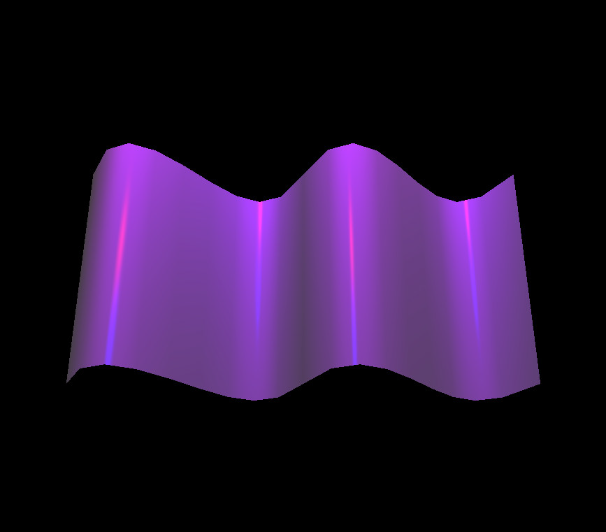
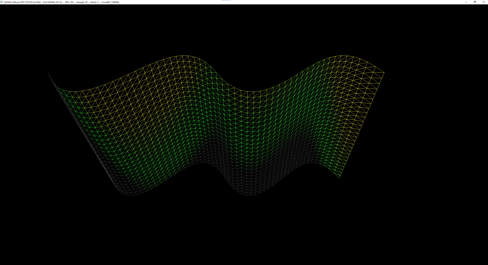

# Bezier Surface Rendering


<p align="center">
<i>Bezier Surface output for input3.txt file</i>
</p>

This project aims to render smooth Bezier surfaces in OpenGL using height information provided through input.txt files. Bezier surfaces are a popular way to represent complex curved shapes, and this implementation allows you to visualize and manipulate them in a 3D environment.

## Features

- Render smooth Bezier surfaces in real-time.
- Accepts height information from `input.txt` files.
- Interactively manipulate the rendered surfaces using various controls.
- Shows the diffuse and specular shading effects of the given point light(s) on the surface

\

<p align="center">
<i>Bezier Surface output for input1.txt file</i>
</p>

\

<p align="center">
<i>Bezier Surface output for input2.txt file</i>
</p>

## Getting Started

### Prerequisites

- OpenGL 3.3 or later.
- C++ compiler supporting C++11 or later.
- The project has been tested on Linux platform.

### Installation

1. Clone the repository:
```
https://github.com/ramazantokay/Bezier-Surface-Rendering.git
```

2. Change into the project directory:
```
cd Bezier-Surface-Rendering
```

3. Build the project using the provided makefile:

```
make all
```

### Usage

1. Place your `input.txt` files containing the height information of the surfaces in the appropriate directory.

2. Run the executable:

```
./main input1.txt
```

3. Use the controls to manipulate the rendered surfaces. 

The keyboard controls are as follows:
  * <kbd>1</kbd> Wireframe Mode
  * <kbd>2</kbd> Solid Mode
  * <kbd>W</kbd> Increase the sample size by 2
  * <kbd>S</kbd> Decrease the sample size by 2
  * <kbd>R</kbd> Increase the rotation angle by 10 (Rotate the surface around the horizontal axis)
  * <kbd>F</kbd> Decrease the rotation angle by 10 (Rotate the surface around the horizontal axis)
  * <kbd>E</kbd> Extend the X and Y coordinates of whole surface by 0.1
  * <kbd>D</kbd> Shrink the X and Y coordinates of whole surface by 0.1

4. Enjoy exploring and visualizing Bezier surfaces!




## Contributing

Contributions are welcome! If you have any suggestions or improvements, feel free to submit a pull request or open an issue in the GitHub repository.

## Contact

If you have any questions, suggestions, or feedback, please feel free to reach out to me at [rmzntokay@gmail.com](mailto:rmzntokay@gmail.com).
